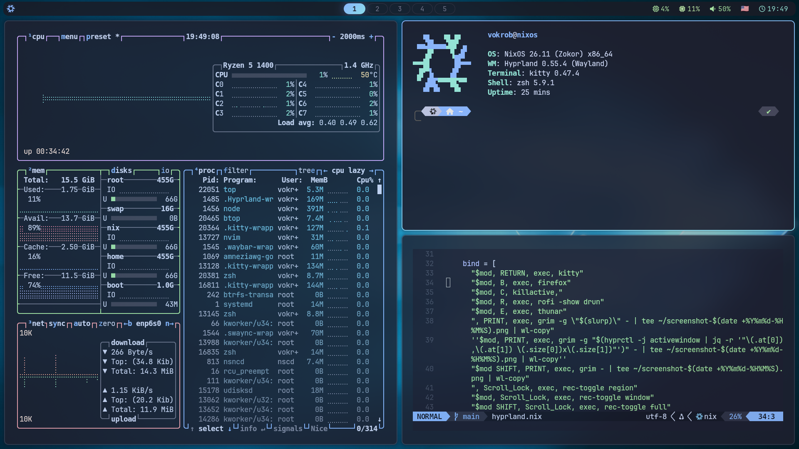

# NixOS + Hyprland



## Description

Personal Flakes configuration with Home Manager.
Unified Catppuccin Mocha theme across all programs: Kitty (Zsh), Rofi, SwayNC, btop, Firefox, Neovim (LSP, Treesitter, DAP, Telescope, Harpoon), Waybar with CPU/RAM monitoring and gradient coloring. Gaming: Steam, Gamescope, MangoHud.

## Tech Stack

| Technology | Purpose |
|---|---|
| [NixOS](https://nixos.org) + [Flakes](https://nixos.wiki/wiki/Flakes) | Operating system, reproducible configuration |
| [Home Manager](https://github.com/nix-community/home-manager) | User environment management |
| [agenix](https://github.com/ryantm/agenix) | Secret encryption |
| [Hyprland](https://hyprland.org) | Wayland compositor |
| [Catppuccin Mocha](https://github.com/catppuccin/catppuccin) | Unified theme |
| [OpenClaw](https://github.com/openclaw/nix-openclaw) | AI assistant with Qdrant memory and Telegram |
| [AmneziaWG](https://github.com/amnezia-vpn/amneziawg-tools) | Encrypted tunnel |

## Installation

### Prerequisites

- **NixOS** already installed
- **age key** generated: `mkdir -p ~/.config/age && age-keygen -o ~/.config/age/key.txt`

### Steps

```bash
sudo mv /etc/nixos /etc/nixos.bak
git clone https://github.com/vokrob/nixos-config.git /etc/nixos

nixos-generate-config --show-hardware-config > /etc/nixos/hosts/nixos/hardware-configuration.nix

grep -oP 'age1\w+' ~/.config/age/key.txt
# Insert the key into secrets.nix replacing the existing one

rm /etc/nixos/secrets/*.age
nix shell nixpkgs#agenix -c agenix -e secrets/codestats-api-key.age
# Repeat for remaining files from secrets.nix

sudo nixos-rebuild switch --flake /etc/nixos#vokrob
# After the first build, the nix-switch alias will be available
```

## Usage

### Personal aliases

| Command | Description |
|---|---|
| `nix-switch` | Apply changes |
| `nix-log` | Commit graph |
| `nix-commit` | Stages all changes and creates a commit with the given message |
| `v` | Open Neovim |

### Customization

- **Packages**: `modules/home/packages.nix`
- **Theme**: replace `blue` in Catppuccin modules
- **Hotkeys**: `modules/home/features/hyprland.nix`
- **Neovim**: `modules/home/programs/neovim.nix`
- **Terminal**: `dotfiles/kitty.conf`
- **Status bar**: `waybar/config.jsonc` and `waybar/style.css`
- **New host**: copy `hosts/nixos/` to `hosts/<hostname>/`, add `<hostname>` to `flake.nix`
