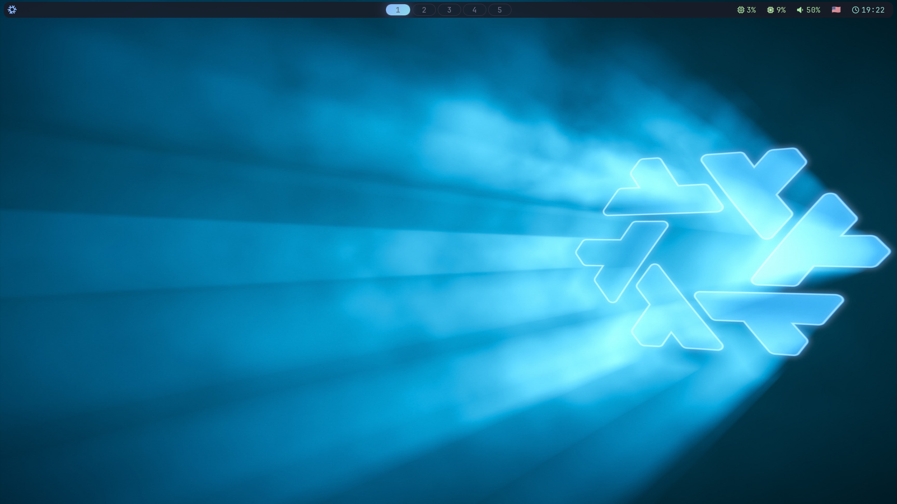
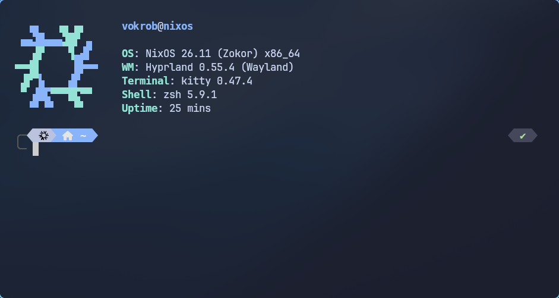

# nixos-config

[](https://nixos.org)
[](https://nixos.wiki/wiki/Flakes)
[](https://github.com/nix-community/home-manager)
[](LICENSE)

## 📷 Скриншоты

| Desktop | Terminal |
|---|---|
|  |  |

## 📋 Описание

Персональная NixOS конфигурация на Flakes с Home Manager.
Единый Catppuccin Mocha стиль во всех программах: GTK, Qt, Kitty, Waybar, Rofi, SwayNC, btop, Firefox, Neovim.

- **Hyprland** + **greetd** — окружение Wayland с автовходом
- **Neovim IDE** — LSP, Treesitter, DAP, Telescope, Harpoon
- **Гейминг** — Steam, Gamescope, MangoHud
- **OpenClaw AI** — ассистент с Qdrant-памятью и Telegram
- **AmneziaWG VPN** — зашифрованный туннель

## 🛠️ Стек технологий

| Технология | Назначение |
|---|---|
| [NixOS](https://nixos.org) + [Flakes](https://nixos.wiki/wiki/Flakes) | Операционная система, воспроизводимая конфигурация |
| [Home Manager](https://github.com/nix-community/home-manager) | Управление пользовательским окружением |
| [agenix](https://github.com/ryantm/agenix) | Шифрование секретов (age) |
| [Hyprland](https://hyprland.org) | Wayland compositor |
| [Catppuccin Mocha](https://github.com/catppuccin/catppuccin) | Единая тема оформления |
| [OpenClaw](https://github.com/openclaw/nix-openclaw) | AI-ассистент |
| [AmneziaWG](https://github.com/amnezia-vpn/amneziawg-tools) | VPN |

## 📁 Структура репозитория

```
flake.nix            # Главная точка входа, inputs + outputs
flake.lock           # Зафиксированные версии зависимостей
hosts/               # Конфигурация для машины
  vokrob/
    default.nix      #   Импорт модулей + hostname/таймзона
    hardware-configuration.nix  # Автосгенерированная конфигурация железа
modules/
  nixos/             # Системные модули NixOS
    base.nix         #   Bootloader, ядро, локаль, шрифты, nix-daemon
    networking.nix   #   NetworkManager + systemd-resolved
    security.nix     #   Polkit
    services.nix     #   Hyprland, greetd, Steam, AmneziaWG, zram, udev
    users.nix        #   Пользователь + agenix secrets
  home/              # Пользовательские модули Home Manager
    base.nix         #   Состояние, XDG dirs
    packages.nix     #   Все пользовательские пакеты
    features/        #   Функциональные блоки
      hyprland.nix   #     Конфиг Hyprland (хоткеи, анимации, blur)
      catppuccin.nix #     GTK/Qt/cursor тема
      dotfiles.nix   #     Kitty, Waybar, SwayNC, Rofi, Thunar
      openclaw.nix   #     AI-ассистент
    programs/        #   Конфиги программ
      neovim.nix     #     Полный Neovim (LSP, Treesitter, DAP)
      firefox.nix    #     Firefox с темой
      btop.nix       #     btop с темой
dotfiles/            # Статические конфиги (kitty, rofi, fastfetch, p10k)
waybar/              # Waybar: стили и скрипты
swaync/              # Sway Notification Center
secrets/             # Age-encrypted секреты
overlays/            # Патчи пакетов (swaync)
patches/             # Исходники патчей
screenshots/         # Скриншоты
```

## 🚀 Установка

### Prerequisites

- **NixOS** уже установлен на диск
- **age ключ** сгенерирован: `mkdir -p ~/.config/age && age-keygen -o ~/.config/age/key.txt`

### Шаги

> **Важно**: на новом железе нужно сгенерировать свой `hardware-configuration.nix` и обновить `secrets.nix` со своим age public key.

```bash
# 1. Клонировать репозиторий
sudo mv /etc/nixos /etc/nixos.bak
git clone https://github.com/vokrob/nixos-config.git /etc/nixos

# 2. Сгенерировать hardware-configuration.nix для своей машины
nixos-generate-config --show-hardware-config > /etc/nixos/hosts/vokrob/hardware-configuration.nix

# 3. Установить agenix и перешифровать секреты
#    Заменить age ключи в secrets.nix на свои
nix shell nixpkgs#agenix -c agenix -e secrets/codestats-api-key.age

# 4. Собрать систему
sudo nixos-rebuild switch --flake /etc/nixos#vokrob
```

## 🎮 Использование

### Основные команды

| Команда | Описание |
|---|---|
| `nixos-rebuild switch --flake .#vokrob` | Пересобрать систему |
| `nix flake update` | Обновить все зависимости |
| `nix flake lock --update-input <input>` | Обновить отдельный input |
| `agenix -e secrets/<file>.age` | Отредактировать секрет |
| `agenix -r` | Перешифровать все секреты |
| `nix-collect-garbage -d` | Очистить старые поколения |

### Управление секретами

Секреты шифруются [agenix](https://github.com/ryantm/agenix) с помощью age-ключа машины.
При сборке они расшифровываются в `/run/agenix/`.

```bash
# Создать новый секрет
agenix -e secrets/my-secret.age

# Перешифровать после смены ключей
agenix -r
```

### Кастомизация

- **Пакеты**: `modules/home/packages.nix`
- **Тема**: заменить `blue` на `mauve`/`green`/`lavender` в Catppuccin-модулях
- **Хоткеи**: `modules/home/features/hyprland.nix`
- **Neovim**: `modules/home/programs/neovim.nix`
- **Терминал**: `dotfiles/kitty.conf`
- **Статус-бар**: `waybar/config.jsonc` и `waybar/style.css`
- **Новый хост**: скопировать `hosts/vokrob/` в `hosts/<hostname>/`, добавить `<hostname>` в `flake.nix`

## 📄 Лицензия

[MIT](LICENSE)
