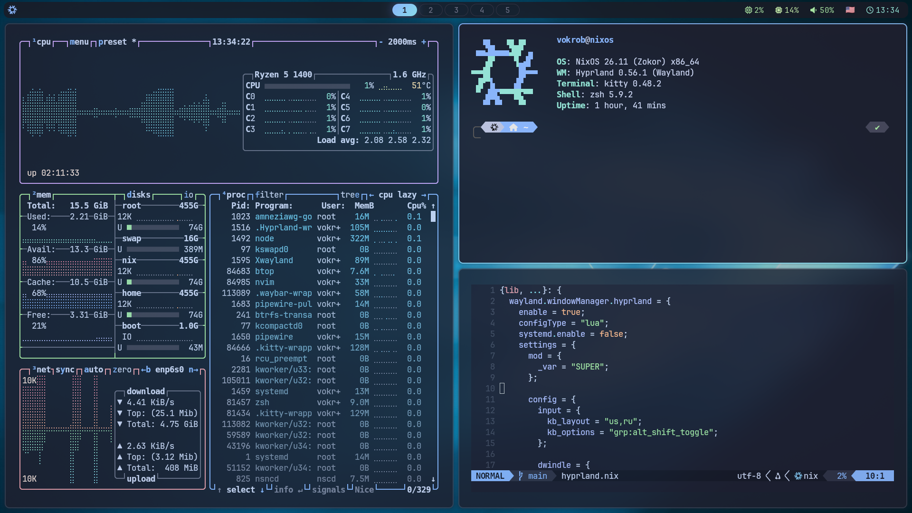

# NixOS + Hyprland



## Description

My personal NixOS setup, built with Flakes and Home Manager. Everything is in Catppuccin Mocha: Kitty, Zsh, Rofi, SwayNC, btop, Firefox, Neovim, Waybar (CPU/RAM graphs) and opencode. OpenClaw (AI assistant) works over Telegram, AmneziaWG keeps the tunnel up, Steam / Gamescope / MangoHud cover gaming.

## Tech Stack

- NixOS + Flakes
- Home Manager
- agenix
- Hyprland
- Catppuccin Mocha
- OpenClaw
- opencode
- AmneziaWG

## Installation

You need NixOS and an age key:

```bash
mkdir -p ~/.config/agenix && nix shell nixpkgs#age -c age-keygen -o ~/.config/agenix/age-key.txt
```

```bash
sudo mv /etc/nixos /etc/nixos.bak
nix shell nixpkgs#git -c git clone https://github.com/vokrob/nixos-config.git ~/nixos-config
sudo ln -s ~/nixos-config /etc/nixos

nixos-generate-config --show-hardware-config > ~/nixos-config/hosts/nixos/hardware-configuration.nix

grep -oP 'age1\w+' ~/.config/agenix/age-key.txt
# put this key into secrets.nix
```

Note: `openclaw-workspace` in `flake.nix` is a local `path:` input (`/home/vokrob/.config/openclaw`
with `AGENTS.md`, `SOUL.md`, `TOOLS.md`, `IDENTITY.md`, `USER.md`, not committed to GitHub).
On a fresh clone create these files (see the placeholder trick in `.github/workflows/check.yml`)
and `nix flake update openclaw-workspace`, or drop the input together with
`modules/home/features/openclaw.nix`.

The secrets live as encrypted `.age` files, re-encrypt them with your key:

```bash
cd ~/nixos-config
rm -f /etc/nixos/secrets/*.age
nix shell nixpkgs#agenix -c agenix -e secrets/codestats-api-key.age -i ~/.config/agenix/age-key.txt
# repeat for the remaining files listed in secrets.nix
```

```bash
sudo nixos-rebuild switch --flake ~/nixos-config#vokrob
```

## Usage

| alias         | what it does               |
|---------------|----------------------------|
| `nix-switch`  | update workspace, rebuild |
| `nix-commit`  | stage everything and commit |
| `nix-log`     | commit graph              |
| `v`           | nvim                      |

### Customization

- packages: `modules/home/packages.nix`
- AI models/provider: `modules/home/programs/opencode.nix`, `modules/home/features/openclaw.nix`
- theme accent: `blue` in `modules/home/features/catppuccin.nix`, `#89b4fa` in `modules/home/features/dotfiles.nix`, `@blue` in `dotfiles/waybar/catppuccin-mocha.css`
- hotkeys: `modules/home/features/hyprland.nix`
- neovim: `modules/home/programs/neovim.nix`
- shell (prompt, aliases): `modules/home/programs/zsh.nix`
- terminal: `dotfiles/kitty.conf`
- waybar: `dotfiles/waybar/config.jsonc`, `dotfiles/waybar/style.css`
- vpn: `modules/nixos/features/vpn.nix`
- new host: copy `hosts/nixos/` to `hosts/<host>/` and add it to `flake.nix`