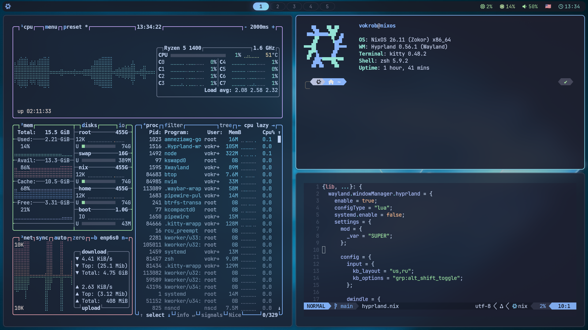

# NixOS + Hyprland



## Description

Personal NixOS setup built with Flakes and Home Manager, using Catppuccin Mocha, Hyprland,
OpenClaw, AmneziaWG, and gaming tools.

## Tech Stack

- NixOS, Flakes, Home Manager
- agenix, AmneziaWG
- Hyprland, Catppuccin Mocha
- Steam, Gamescope, MangoHud
- OpenClaw

## Installation

Requires x86_64 NixOS with flakes, Git, sudo, an age key, and Nix 2.34+.

```bash
mkdir -p ~/.config/agenix && nix shell nixpkgs#age -c age-keygen -o ~/.config/agenix/age-key.txt
sudo mv /etc/nixos /etc/nixos.bak
nix shell nixpkgs#git -c git clone https://github.com/vokrob/nixos-config.git ~/nixos-config
sudo ln -s ~/nixos-config /etc/nixos
nixos-generate-config --show-hardware-config > ~/nixos-config/hosts/nixos/hardware-configuration.nix
```

```bash
cd ~/nixos-config
grep -oP 'age1\w+' ~/.config/agenix/age-key.txt  # put the key into secrets.nix
rm -f /etc/nixos/secrets/*.age
nix run github:ryantm/agenix -- -e secrets/codestats-api-key.age -i ~/.config/agenix/age-key.txt
# repeat for the remaining files listed in secrets.nix
sudo nixos-rebuild switch --flake ~/nixos-config#vokrob
# Replace vokrob and Telegram allowlists with your values
```

## Usage

| alias        | what it does                       |
|--------------|------------------------------------|
| `nix-switch` | update the workspace lock, stage changes, rebuild |
| `nix-commit` | stage changes and commit           |
| `nix-log`    | show the commit graph              |
| `v`          | open nvim                          |
